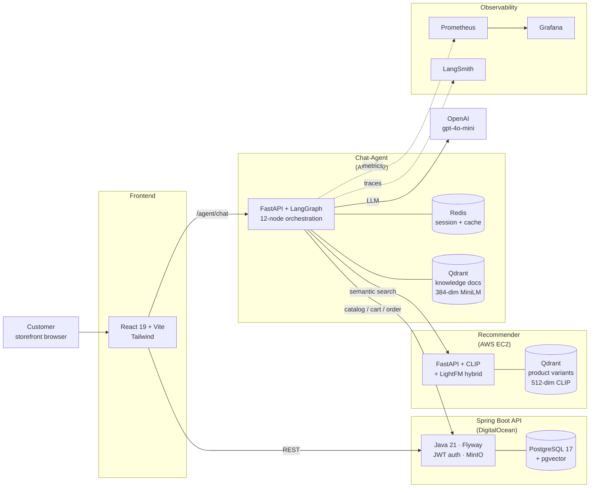
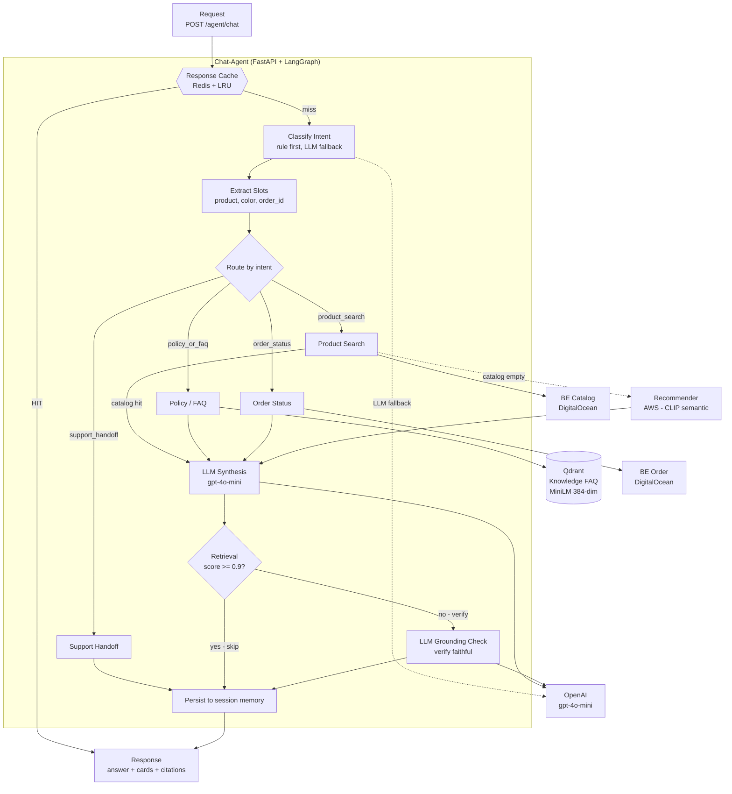
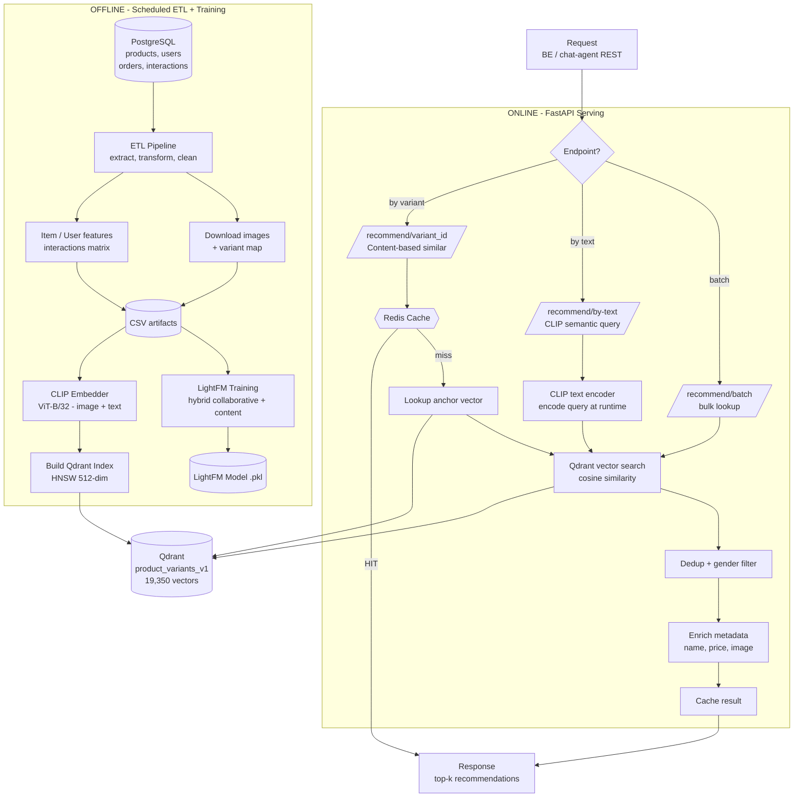

# E-Shop — Full-Stack Commerce Platform with Agentic AI Chatbot

> A production-grade e-commerce reference implementation featuring an **Agentic RAG chatbot** built on LangGraph, a hybrid **content + collaborative recommender** with CLIP embeddings, and full observability from day one.

[]()
[](http://13.213.105.94:8010/agent/health)
[](http://18.143.45.118:8000/health)
[](https://eshop-api-5dx33.ondigitalocean.app/actuator/health)
[]()

---

## Highlights

- **Agentic RAG chatbot** — 12-node LangGraph orchestration with intent classification, tool routing, grounding checks, and multi-turn context that survives container restarts.
- **~70% OpenAI cost reduction** through response caching, LRU-cached intent classification, and confidence-gated grounding checks — without trimming a single prompt.
- **Production security posture** — per-IP rate limiting, prompt-injection blocklist, output sanitization, and shared circuit breakers for OpenAI + Spring backend.
- **Hybrid recommender** — CLIP visual+text embeddings for content similarity, LightFM for collaborative signals, served through FastAPI with Redis caching.
- **Full observability stack** — Prometheus + Grafana (8-panel live dashboard), LangSmith LLM tracing, JSON structured logs with PII redaction.
- **19,350+ product vectors** indexed in Qdrant, sub-100ms cache hits, semantic fallback across the whole catalog.
- **Deployed live** on AWS EC2 (chat-agent + recommender) and DigitalOcean (Spring API + PostgreSQL).

---

## Live Demo

| Service | URL | Note |
|---|---|---|
| Chat-agent API | `http://13.213.105.94:8010/agent/chat` | POST endpoint — see `curl` example below |
| Recommender API | `http://18.143.45.118:8000/health` | Health + docs at `/docs` |
| Spring backend | `https://eshop-api-5dx33.ondigitalocean.app/actuator/health` | DigitalOcean App Platform |
| Grafana dashboard | `http://13.213.105.94:3000/d/chat-agent-prod` | Anonymous viewer enabled |
| Prometheus | `http://13.213.105.94:9090` | Live metrics |

Try the chatbot:

```bash
curl -X POST http://13.213.105.94:8010/agent/chat \
  -H 'Content-Type: application/json' \
  -d '{"sessionId":"readme-demo","message":"show me some blue jackets"}'
```

---

## System Architecture



---

## Tech Stack

| Layer | Technologies |
|---|---|
| **Frontend** | React 19, Vite, Tailwind CSS, TypeScript |
| **Backend API** | Spring Boot 3.5, Java 21, Flyway, JWT, MinIO, SpringDoc |
| **Database** | PostgreSQL 17 + pgvector, Redis 7 |
| **Chat-Agent** | Python 3.12, FastAPI, **LangGraph**, OpenAI gpt-4o-mini, Qdrant, sentence-transformers (MiniLM) |
| **Recommender** | Python, FastAPI, **CLIP ViT-B/32**, **LightFM**, Qdrant HNSW, LangSmith |
| **Observability** | **Prometheus**, **Grafana**, **LangSmith**, structured JSON logs with PII redaction |
| **Deployment** | Docker Compose, AWS EC2 (Singapore), DigitalOcean App Platform |

---

## Repository Layout

```
e-shop/
├── backend/e-shop/         # Spring Boot 3.5 API (Java 21)
├── client/                 # React 19 storefront (Vite + Tailwind)
├── admin/                  # React 19 admin dashboard
├── chat-agent/             # FastAPI + LangGraph agentic RAG service
│   ├── app/
│   │   ├── graph/          # LangGraph nodes & orchestration
│   │   ├── services/       # Redis, response cache, circuit breaker, LLM
│   │   ├── clients/        # Spring backend + recommender clients
│   │   └── tools/          # LangGraph tools (catalog, order, cart, knowledge, recommendation)
│   ├── observability/      # Grafana provisioning + dashboards
│   └── tests/              # 252 tests
├── recomender/             # ETL pipeline + FastAPI serving CLIP + LightFM
│   ├── etl/
│   │   ├── Content_Base_Model/   # CLIP + Qdrant serving
│   │   └── model_tranning/       # LightFM training
│   └── Docker/             # docker-compose for recommender stack
├── docs/                   # Architecture + flow docs, deployment guides
└── scripts/                # Deploy + smoke test + bootstrap scripts
```

---

## Quick Start (Docker)

```bash
# 1. Local Spring backend + PostgreSQL + MinIO
docker compose up --build

# 2. In another terminal — chat-agent + Qdrant
cd chat-agent
docker compose -f docker-compose.aws.yml up --build

# 3. In another terminal — storefront
cd client
npm install && npm run dev
```

Services boot on:

- Backend API: `http://localhost:8080` (Swagger at `/swagger-ui.html`)
- Chat-agent: `http://localhost:8010/agent/chat`
- Frontend: `http://localhost:5173`
- MinIO console: `http://localhost:9090` (`admin` / `admin123`)

Default seeded credentials:

- Admin — `admin@gmail.com` / `123456`
- Demo customer — `demo.customer@eshop.local` / `123456`

---

## Chatbot Deep Dive

The chat-agent is the flagship AI feature. It's an **Agentic RAG system** — the LLM routes user intent through 12 LangGraph nodes, calls tools when needed, and self-evaluates its answer before responding.

### LangGraph flow



Node sequence: `load_session_context → normalize_message → input_guardrails → classify_intent → extract_slots → route_intent → rewrite_query_for_retrieval → [handle_product | handle_recommendation | handle_faq | handle_order | handle_handoff] → ground_response_in_tool_results → refine_grounded_answer_with_llm → output_guardrails → format_structured_response`

### Key design decisions

- **Cost-first**: keyword rule classifier runs before LLM (~1ms free path). LLM only fires when confidence is low. Response cache short-circuits repeat FAQs to <100ms with zero LLM calls.
- **Multi-tool routing**: intent classifier decides which tool to call — catalog search, order status, recommender (semantic CLIP), knowledge base (RAG), or human handoff.
- **Grounding check**: LLM-as-judge verifies the synthesised answer is faithful to retrieved documents. Fail-closed on judge errors — no silent hallucinations.
- **Session persistence via Redis** — multi-turn context ("show me jackets" → "any blue ones?" → "anything cheaper?") survives container restarts.
- **Rate limiting** (30 req/min per IP), **prompt-injection blocklist** (7 regex patterns), **output sanitization** (script tags, unsafe URIs, 2000-char cap).
- **Circuit breakers** for both OpenAI and Spring backend — one failing dependency does not cascade site-wide latency.

### Production metrics (observed)

- **252 tests pass** — LangGraph nodes, tools, clients, guardrails
- **Sub-100ms latency** on cached FAQ responses
- **~2-3s latency** on full LLM synthesis path (product recommendation)
- **~70% OpenAI cost reduction** vs naive per-request LLM calls (measured on a synthetic evaluation set)
- **Live traces** in LangSmith for every request

See [`chat-agent/README.md`](chat-agent/README.md) for local dev setup and [`chat-agent/observability/README.md`](chat-agent/observability/README.md) for the Grafana dashboard walkthrough.

---

## Recommender Service

Independent FastAPI service that combines two recommendation strategies:

- **Content-based** — CLIP ViT-B/32 embeds product images + text into 512-dim vectors, indexed in Qdrant (HNSW). Used for "similar to this" and semantic text search ("lightweight summer shirt for hiking").
- **Collaborative** — LightFM hybrid model trained on user-item interaction history. Used for personalized recommendations when user history is available.

### Recommender flow



Pipeline summary:

1. **Offline** (scheduled) — ETL pulls interactions from PostgreSQL, encodes 19,350+ product variants through CLIP, builds Qdrant index, trains LightFM.
2. **Online** — FastAPI serves three endpoints:
   - `GET /recommend/{variant_id}` — similar products for a variant
   - `POST /recommend/by-text` — CLIP semantic text search
   - `POST /recommend/batch` — bulk lookup

Redis caches results (TTL 1h). See [`recomender/`](recomender/) for training + deploy specifics.

---

## Testing

```bash
# Backend unit + integration tests
cd backend/e-shop && ./mvnw test

# Chat-agent tests (252 tests, ~20s)
cd chat-agent
python -m pytest

# End-to-end chatbot smoke test against live stack
chmod +x scripts/chatbot-integration-smoke.sh
API_BASE_URL=http://127.0.0.1:8080 \
CHAT_AGENT_URL=http://127.0.0.1:8010 \
./scripts/chatbot-integration-smoke.sh
```

The e2e smoke check validates:

- Spring `/actuator/health` responds `UP`
- Chat-agent `/agent/health` responds `ok`
- Demo customer login returns a JWT
- `/api/chat/messages` returns a structured chat response with trace propagation
- Persisted `USER` and `ASSISTANT` messages appear in session history

Optional draft-flow coverage:

```bash
CHECK_DRAFT_FLOW=true ./scripts/chatbot-integration-smoke.sh
```

Extends coverage to `cart.add` and `support.handoff` draft confirmation + cancellation flows.

---

## Deployment

### Backend (DigitalOcean App Platform)

Spec in [`.do/backend-app.yaml`](.do/backend-app.yaml). Guide in [`docs/deploy-digitalocean.md`](docs/deploy-digitalocean.md).

### Chat-agent + Qdrant + Redis + Prometheus + Grafana (AWS EC2)

One-command deploy to a t3.large EC2:

```bash
export EC2_HOST=<your-ec2-public-ip>
export SSH_KEY=~/.ssh/<your-key>.pem
export OPENAI_API_KEY=sk-...
export BACKEND_BASE_URL=https://your-backend.ondigitalocean.app
export RECOMMENDER_BASE_URL=http://<recommender-ip>:8000
export GRAFANA_ADMIN_PASSWORD=<strong-password>
./scripts/deploy-chat-agent.sh
```

The script rsyncs source, writes a remote `.env`, rebuilds the Docker image, waits for `/agent/health`, and re-ingests the knowledge collection. Bootstrap script for a fresh EC2 is in [`scripts/bootstrap-ec2-chat-agent.sh`](scripts/bootstrap-ec2-chat-agent.sh).

### Recommender (AWS EC2)

Compose file at [`recomender/Docker/docker-compose.yml`](recomender/Docker/docker-compose.yml). Auto-recovers on host reboot (restart policies + Qdrant TCP healthcheck).

---

## Sample Data

The repository ships a helper script that loads a real Patagonia catalog (612 products across 23 categories):

```bash
chmod +x scripts/load_patagonia_seed.sh
./scripts/load_patagonia_seed.sh
```

It downloads the seed from GitHub Releases and applies it to the local PostgreSQL. Override the target with `DATABASE_URL=postgres://... ./scripts/load_patagonia_seed.sh`.

---

## Roadmap

- **Streaming responses** — SSE endpoint so the customer sees the LLM answer token-by-token
- **Multi-region deployment** — active-active across Singapore + Mumbai
- **Log aggregation** — Loki + Promtail unified with the existing Prometheus + Grafana stack
- **Fine-tuned Vietnamese embeddings** — better retrieval for Vietnamese FAQ queries
- **A/B testing framework** — prompt versioning + LLM judge for regression prevention

---

## Further Reading

- [`docs/chat-agent-flow.md`](docs/chat-agent-flow.md) — 12-node LangGraph flow with speaker notes
- [`docs/recommender-flow.md`](docs/recommender-flow.md) — Recommender offline + online pipeline
- [`docs/chat-architecture-overview.md`](docs/chat-architecture-overview.md) — System-level architecture
- [`chat-agent/observability/README.md`](chat-agent/observability/README.md) — Grafana dashboard + Prometheus setup

---

## License

MIT
