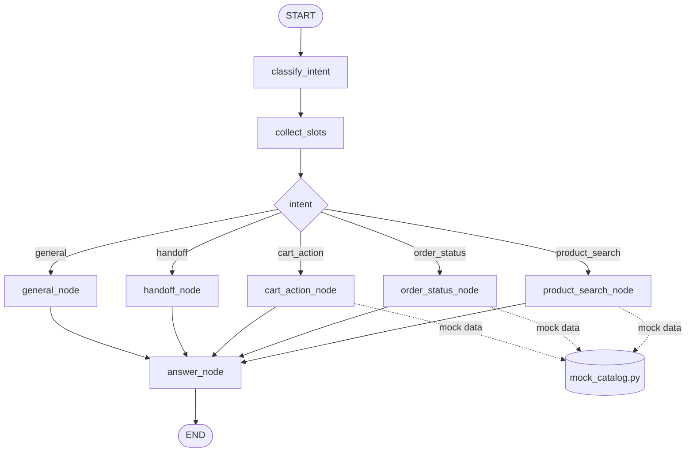
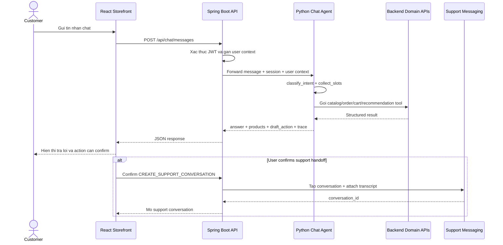
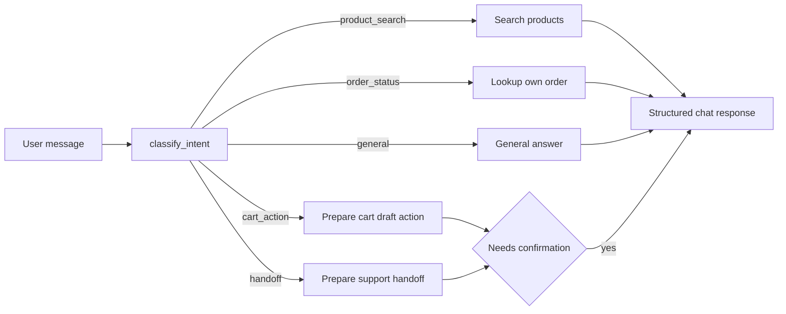

# Chat Agent Workflow Diagram

Ngay tao: 2026-05-01

## LangGraph Prototype Hien Tai

```mermaid
flowchart TD
    Start([START]) --> Classify[classify_intent]
    Classify --> Slots[collect_slots]

    Slots --> Product{intent}
    Product -->|product_search| ProductSearch[product_search_node]
    Product -->|order_status| OrderStatus[order_status_node]
    Product -->|cart_action| CartAction[cart_action_node]
    Product -->|handoff| Handoff[handoff_node]
    Product -->|general| General[general_node]

    ProductSearch --> Answer[answer_node]
    OrderStatus --> Answer
    CartAction --> Answer
    Handoff --> Answer
    General --> Answer
    Answer --> End([END])

    ProductSearch -. mock data .-> MockCatalog[(mock_catalog.py)]
    OrderStatus -. mock data .-> MockCatalog
    CartAction -. mock data .-> MockCatalog
```

## Flow Tich Hop De Xuat

```mermaid
sequenceDiagram
    actor Customer
    participant Storefront as React Storefront
    participant Backend as Spring Boot API
    participant Agent as Python Chat Agent
    participant Tools as Backend Domain APIs
    participant Support as Support Messaging

    Customer->>Storefront: Gui tin nhan chat
    Storefront->>Backend: POST /api/chat/messages
    Backend->>Backend: Xac thuc JWT va gan user context
    Backend->>Agent: Forward message + session + user context
    Agent->>Agent: classify_intent + collect_slots
    Agent->>Tools: Goi catalog/order/cart/recommendation tool
    Tools-->>Agent: Structured result
    Agent-->>Backend: answer + products + draft_action + trace
    Backend-->>Storefront: JSON response
    Storefront-->>Customer: Hien thi tra loi va action can confirm

    alt User confirms support handoff
        Storefront->>Backend: Confirm CREATE_SUPPORT_CONVERSATION
        Backend->>Support: Tao conversation + attach transcript
        Support-->>Backend: conversation_id
        Backend-->>Storefront: Mo support conversation
    end
```

## Intent Va Action

```mermaid
flowchart LR
    UserMessage[User message] --> Intent[classify_intent]
    Intent -->|product_search| Search[Search products]
    Intent -->|order_status| Order[Lookup own order]
    Intent -->|cart_action| Cart[Prepare cart draft action]
    Intent -->|handoff| Staff[Prepare support handoff]
    Intent -->|general| General[General answer]

    Search --> Response[Structured chat response]
    Order --> Response
    Cart --> Confirm{Needs confirmation}
    Staff --> Confirm
    General --> Response
    Confirm -->|yes| Response
```
